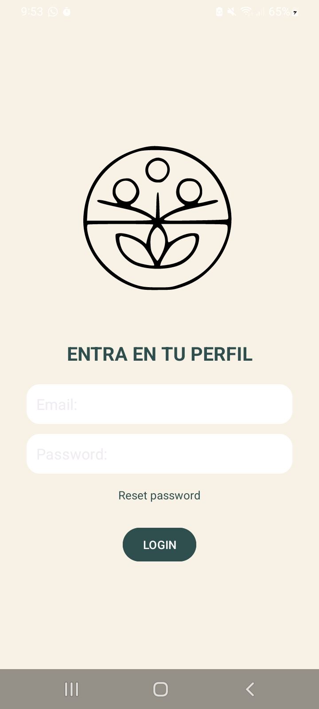
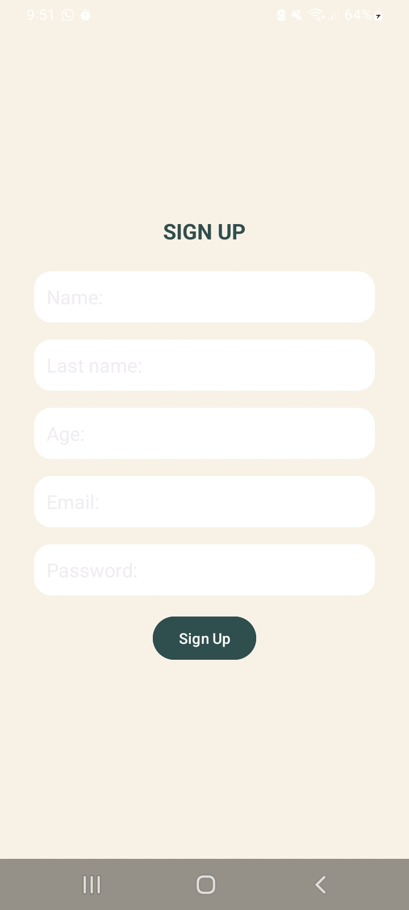
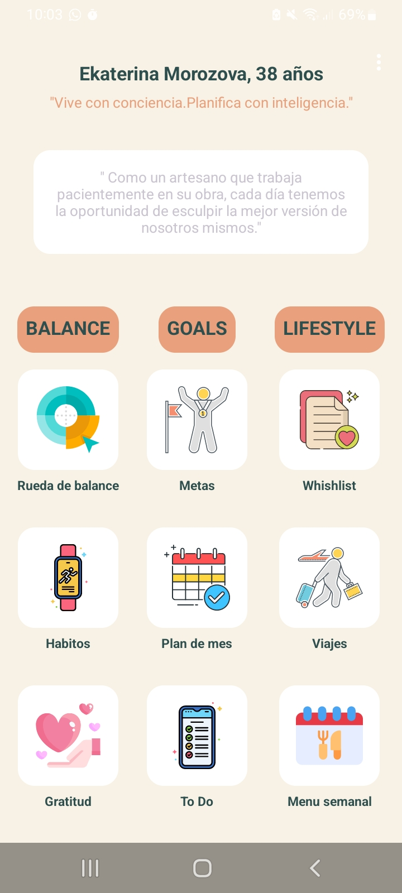
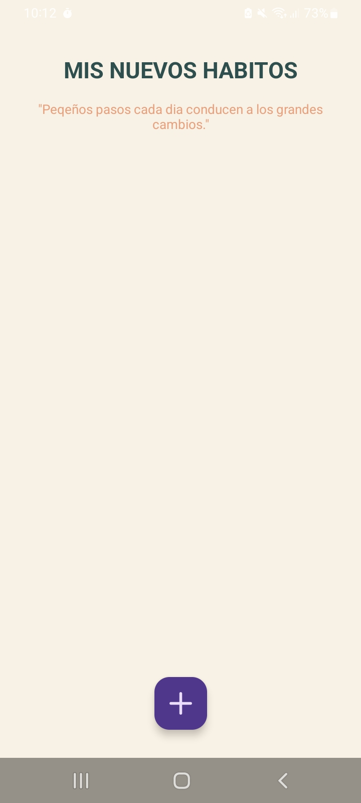

# balance-lifestyle-app
BALANCE LIFESTYLE es una aplicacion movil que sigue en processo de desarrollo. Esta aplicacion enfocada en ayudar a las personas con TDAH y cualquer persona que desee organizar su vida de forma consistente y gestionar su dia a dia utilizando una solo aplicacion.

La idea de crear esta aplicacion fue para aprender la programacion de aplicaciones moviles de forma autodidacta, empezando con el lenguage de Java junto con entorno de desarrollo Android, tambien para aprender de trabajar con diferentes librerias como Room, RxJava cuidando el codigo utilizando la arquitectura MVVM. El proyecto prevee aprender tambien parte de backend(propia base de datos para una Activity), diferentes APIs ente otras tecnologias.

## Funcionalidades actuales

** Pantalla de inicio (MainActivity, MainViewModel) donde usuario puede elegir entrar o registrarse.
** Pantalla de inicio de la session mediante login (LoginActivity, LoginViewModel) con Firebase Authentication.
** Pantalla de recuperar contraseña (ResetPasswordActivity, ResetPasswordViewModel) con Firebase Authentication.
** Pantalla de registro usuario (SignUpActivity, SignUpViewModel) con Firebase Authentication, SharedPreferences(para guardar los datos de usuario y luego poder mostrarlos en otra Activity).
** Pantalla principal (UserActivity, UserViewModel) con navegacion a diferentes secciones, mostrando los datos de usuario como nombre, apellido y su edad.
** Menu con pestañas que permite a usuario SALIR y ELIMINAR PERFIL.
** Pantalla de habitos (HabitsActivity, HabitsViewModel, HabitsAdapter, Habit, HabitsDao, HabitDatabase) para añadir y eliminar los habitos mediante un swipe.
** Pantalla para añadir los habitos (AddHabitActivity, AddHabitViewModel) que permite añadir los habitos dependiendo a que tipo de habito pertenece pintado a un color determinado.
** Pantalla de las listas de deseo (WishListActivity, WishListAdapter, WishList, WishListDao, WishListDatabase) para añadir y eliminar las listas. Logica de guardar y eliminar esta en processo de desarrollo*
** Pantalla para añadir nota en una de las listas de deseo (AddWishListActivity). Logica de guardar esta en proceso de desarrollo*
** Pantalla de tareas (ToDoActivity) para mostrar la lista de tareas guardadas, que permite añadir y eliminar una tarea. Logica de añadir y eliminar esta en proceso de desarrollo*
** Pantalla de añadir tareas (AddToDoActivity). Logica de guardar esta en proceso de desarrollo*

## Tecnologias utilizadas

- Java
- Android Studio
- Firebase Authentication
- SharedPreferences
- Room
- RxJava
- XML layouts

## Proximos pasos

- Añadir logica completa para ToDo y WishList
- Crear logica para Rueda de la vida, Metas, Plan de mes, Viajes, Gratitud, Menu semanal, Trecker de habitos, Timer, Meditation
- Crear modulo de objetivos personales con sistema de progreso
- Implementar recordatorios y notificaciones
- Mejorar la experiencia de usuario
- Añadir unit tests
- Version futura: migracion a Flutter

## Capturas de pantalla

### Pantalla de inicio

### Pantalla de LOGIN

### Pantalla de RESET PASSWORD

### Pantalla de SIGN UP

### Pantalla de usuario

### Pantalla de menu

### Pantalla de HABITOS

### Pantalla de AÑADIR HABITOS

### Pantalla de HABITOS (habito añadido)

### Pantalla de WISHLIST

### Pantalla de TO DO

### Pantalla de AÑADIR NOTA

## Autora

**Ekaterina Morozova**
estudiante autodidacta de aplicaciones moviles(Android con Java)

